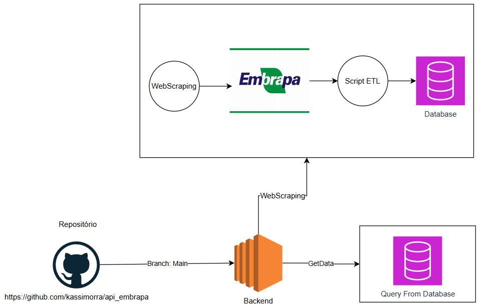

# Fase 1 ML Ops FIAP

Este repositório tem como objetivo a realização da primeira fase do Tech Challenge do Curso de MLOps da FIAP. Nesta etapa, faz se necessário realizar o WebScrapping do site da Embrapa.
As informações que estamos buscando são:
- Produção
- Processamento
- Comercialização
- Importação
- Exportação

Este repositório trata-se de um BackEnd API com Python utilizando-se do framework FastAPI.

Existem duas soluções implantadas nesse momento, devido a algumas particularidades do site:
- Solução 1 (Solicitado): WebScrapping do site, podendo escolher o tipo da informação e o ano de extração.
- Solução 2 (Devido a instabilidade do site): Implementado uma solução de download direto dos arquivos do site.

Para testes unitários foi utilizado o PyTest.

Name | Statements | Missing | Excluded | Coverage
--- | --- | --- | --- | ---
helpers\__init__.py | 0 | 0 | 0 | 100%
helpers\etlFiles.py | 121 | 121 | 0 | 0%
helpers\fastapiconf.py | 9 | 9 | 0 | 0%
helpers\hlpCsv.py | 8 | 0 | 0 | 100%
helpers\hlpDownload.py | 9 | 1 | 0 | 89%
helpers\hlpEmbrapa.py | 14 | 5 | 0 | 64%
routers\__init__.py | 0 | 0 | 0 | 100%
routers\authentication.py | 25 | 25 | 0 | 0%
routers\embrapa.py | 17 | 17 | 0 | 0%
routers\embrapaScrapper.py | 20 | 20 | 0 | 0%
routers\etl.py | 15 | 15 | 0 | 0%
Total | 238 | 213 | 0 | 11%

Os arquivos são gerados em csv e salvos em uma pasta padrão (/arquivos) do projeto.

# Desenho da ingestão de dados

# O que esperamos no futuro ?

Subir essa parte de ingestão na AWS como uma esteira automatizada 
